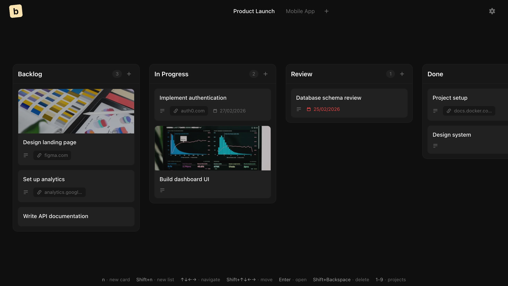

# board

A privacy-focused, local-only Kanban board. No account required — your data stays in your browser.



## Use It Now

👉 **[floschu.github.io/board](https://floschu.github.io/board/)**

- Works instantly in your browser
- Install as an app: click the install icon in your browser's address bar
- All data stays 100% local on your device
- Works offline after first visit

---

## Self-Host - Docker

Run your own instance with data persisted to SQLite. Just provide a port and a folder for your data.

### Docker Compose

```bash
git clone https://github.com/floschu/board.git
cd board
docker compose up -d
open http://localhost:3000
```

### Docker via ghcr

```bash
docker run -d -p 3000:3000 -v board-data:/app/data ghcr.io/floschu/board
open http://localhost:3000
```

### Configuration

| Variable | Default | Description |
|----------|---------|-------------|
| `PORT` | `3000` | Port the server listens on inside the container |
| `DATA_DIR` | `/app/data` | Directory where the SQLite database (`board.db`) is stored |

Mount a volume or bind a local folder to `DATA_DIR` so your data survives container restarts:

```bash
# Named volume (managed by Docker)
docker run -d -p 3000:3000 -v board-data:/app/data ghcr.io/floschu/board

# Local folder (e.g. for Unraid, Synology, or manual backups)
docker run -d -p 3000:3000 -v /path/to/your/folder:/app/data ghcr.io/floschu/board
```

## Self-Host - Cloudflare

Deploy your own synced instance to Cloudflare (data stored in [Cloudflare D1](https://developers.cloudflare.com/d1/),
no server to run) in one click. It copies this repo to your account, **auto-creates the
database**, and deploys:

[](https://deploy.workers.cloudflare.com/?url=https://github.com/floschu/board)

Your board data **persists across updates** (the database is separate from the deployed
code). The `/api/data` endpoint is unauthenticated, so if the deployment is reachable
publicly, put it behind an access control such as
[Cloudflare Access](https://developers.cloudflare.com/cloudflare-one/policies/access/).

Prefer the CLI, or want to know how updates work? See **[CLOUDFLARE.md](CLOUDFLARE.md)**.

## Development

```bash
npm install
npm run dev
open http://localhost:5173
```
